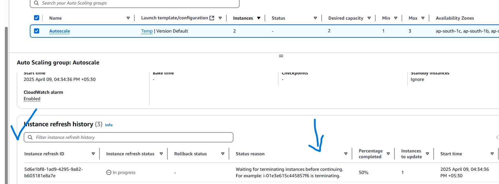
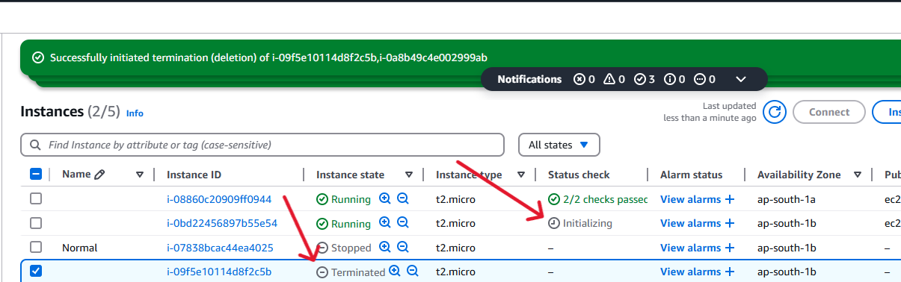

# 🚀 Auto Scaling Architecture with Instance Refresh on AWS

## 🔧 Step-by-Step Setup

### 1️⃣ Create a Custom AMI

- 🚀 Launched an EC2 instance with a pre-installed web server and application.
- 🧪 Used a **basic HTML template** for testing (but it can be a fully configured production-grade web app).
- 🛠️ After configuring the application, created a **Custom AMI** from the instance to reuse for scaling or quick deployment.

<p align="center">
  
</p>


### 2. Build a Launch Template
- Created a **Launch Template** using the above AMI.
- This template includes instance type, AMI ID, key pair, security groups, and other settings needed for launching new instances.
    


### 3. Set Up Elastic Load Balancer (ELB)
- Created an **Application Load Balancer (ALB)**.
- Set up a **Target Group** to manage backend EC2 instances.
- Configured listeners on port 80 (HTTP) to forward traffic to the Target Group.
- (Since I didn’t have an existing ELB, I created a new one while setting up the Auto Scaling Group, along with a new Target Group).

### 4. Configure Auto Scaling Group (ASG)
- Used the Launch Template to configure an ASG.
- Set the **Desired Capacity to 2**, **Maximum to 3**, and **Minimum to 1**.
    
  
- Registered the Target Group so new instances are automatically added.
- Enabled **Instance Refresh** for zero-downtime updates.
    


---

## 🧪 Load Testing and Scaling Behavior

- Connected to two EC2 instances via **SSH using PowerShell**.
- Manually applied CPU stress to simulate high load.
- commands which are used for manual load.
  <br>
  ```sudo yum install stress -y```
  <br>
  ```stress --cpu 8 --timeout 60 ```
   
  
- Observed that when CPU crossed threshold, **Auto Scaling launched a third instance** automatically.
   
    
- This showed that scaling policy works as expected!

---

## 🔁 Instance Refresh for Smooth Updates

To simulate a real-world update (e.g., app or config change):
  
  
1. **Updated Launch Template** with new version (e.g., changed HTML content).
2. **Triggered Instance Refresh** with **50% batch size**.
  
   
4. AWS gracefully terminated 1 instance and launched a new one using updated template.
  
   
6. After replacement, reloaded the browser — the **new app version was live** without any downtime.
  


---

## 📌 Key Learnings

- Launch Templates and AMIs make deployments consistent and reusable.
- Auto Scaling ensures high availability and performance during traffic spikes.
- Instance Refresh enables rolling updates without disturbing running apps.

---

## 🧰 Tools Used

- AWS EC2
- Ami and Template
- AWS Load Balancer
- Auto Scaling Group
- PowerShell SSH
- Stress Testing via CPU Load
  

---
