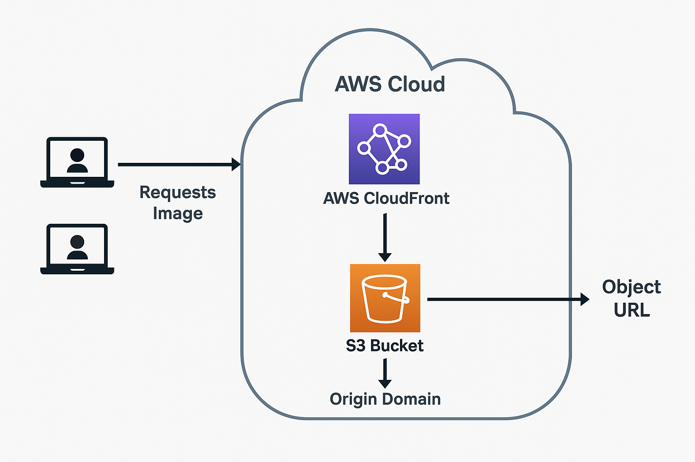
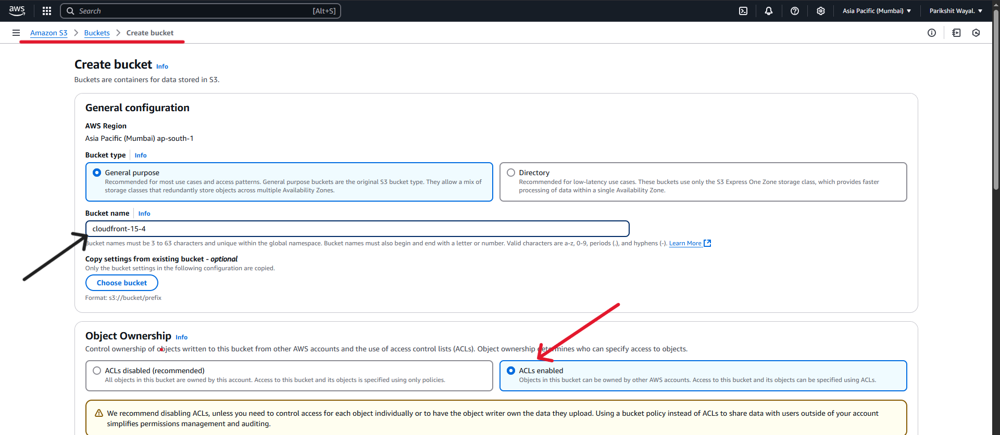
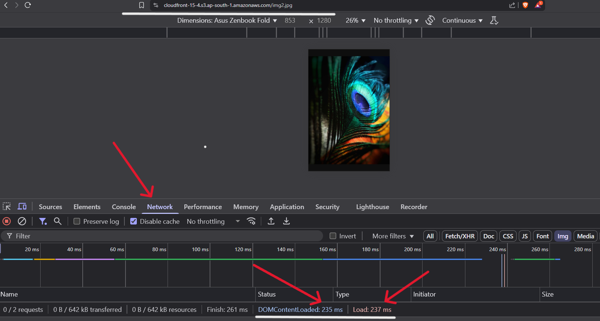
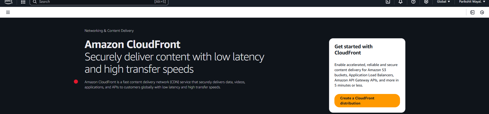
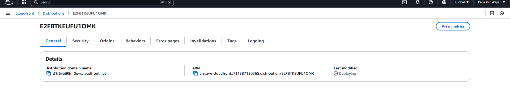
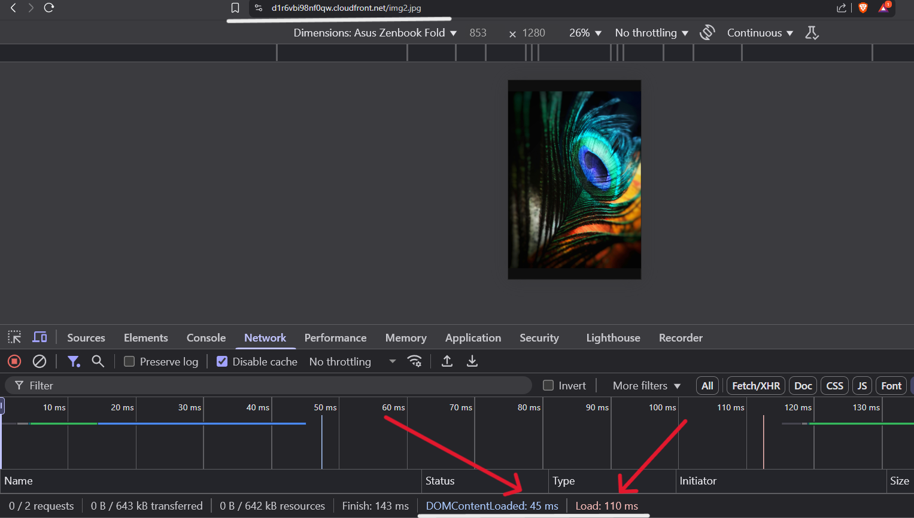

# ☁️ Optimizing Static File Delivery with Amazon S3 + CloudFront

This project demonstrates how to reduce latency for delivering static files (images, videos, files) by integrating **Amazon S3** with **CloudFront CDN**.
    

---

## Overview

In this setup, an S3 bucket with ACL enabled is used to store your static files. CloudFront is then configured to cache these files at edge locations, reducing the time it takes for users to load these assets. The performance benefit is measured by comparing load times before and after adding CloudFront to the architecture.

---

## Step-by-Step Guide

1. **Create an S3 Bucket (ACL Enabled)**
   - Create an **Amazon S3 bucket** to store your static assets.
   - I created an S3 bucket with a unique name **cloudfront-15-4**.
   - Enable **ACLs (Access Control Lists)** for public read access.
         
   - Upload a sample image (e.g., `test.jpg`).
   - Note the **Object URL** provided by S3, e.g.:
         
     

2. **Test Load Time from S3**
   - Open your browser's **Developer Tools** and navigate to the **Network Tab**.
   - Paste the S3 Object URL and press Enter.
         
   - Record the load time (e.g., ~300ms).

3. **Set Up a CloudFront Distribution**
   - Create a new **CloudFront distribution**.
         
   - Set the **Origin Domain** to point to your S3 bucket.
   - Use the default caching and behavior settings.
   - After deployment, note the **CloudFront Domain Name** (e.g., `https://d1234abcde.cloudfront.net`).
         

4. **Compare Performance: S3 vs CloudFront**
   - Open the **Developer Tools** (Network Tab) in your browser again.
   - Replace the S3 domain in the file's URL with your CloudFront domain. For example:
   
   - Press Enter and observe the new load time.
   - ✅ You should notice a reduced latency due to CloudFront’s edge caching and optimization.
         

## Key Learnings

- **Amazon S3** provides scalable storage for static content.
- **CloudFront CDN** reduces latency by caching content at edge locations.
- Leveraging CloudFront improves performance and enhances user experience by:
  - Reducing file load time.
  - Optimizing bandwidth.
  - Delivering content more efficiently on a global scale.

---

## Services Used

- **Amazon S3** (with ACL enabled)
- **Amazon CloudFront**
- **Browser Developer Tools** (Inspect → Network)
- **Static Files** (images, videos, documents for performance testing)

---

## Conclusion

By integrating CloudFront with your S3 bucket, you efficiently lower latency, ensuring your static assets load faster for end users. This architecture not only boosts performance but also improves overall user satisfaction.

---

