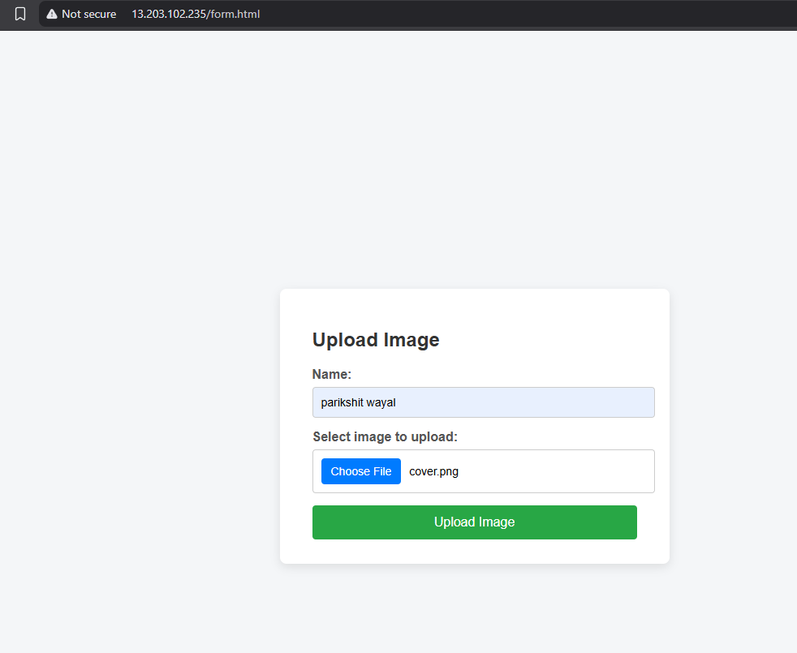
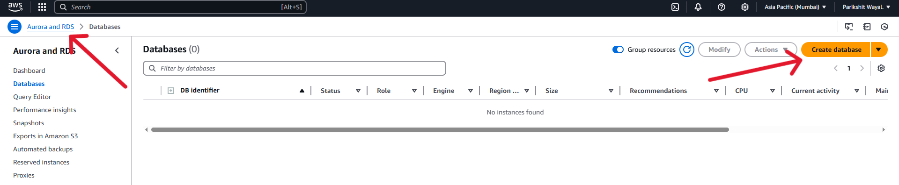
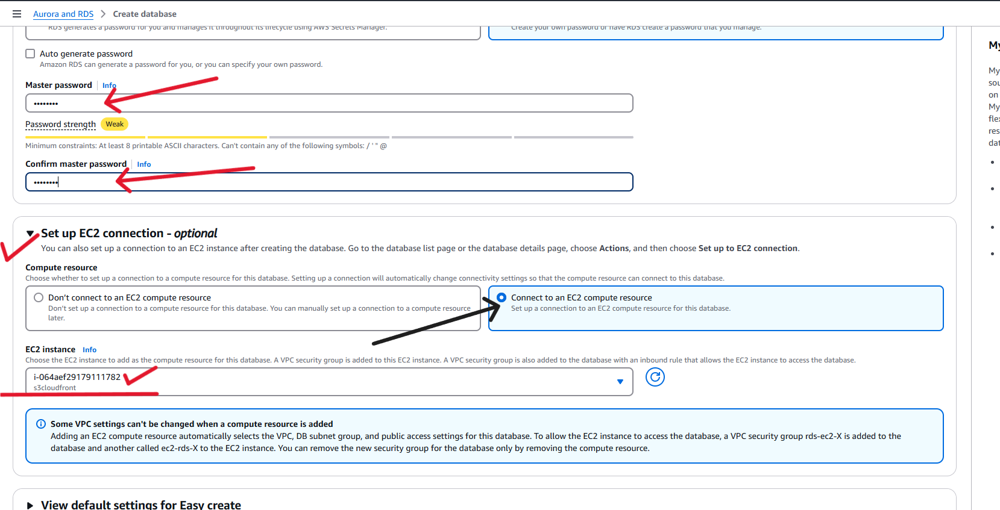
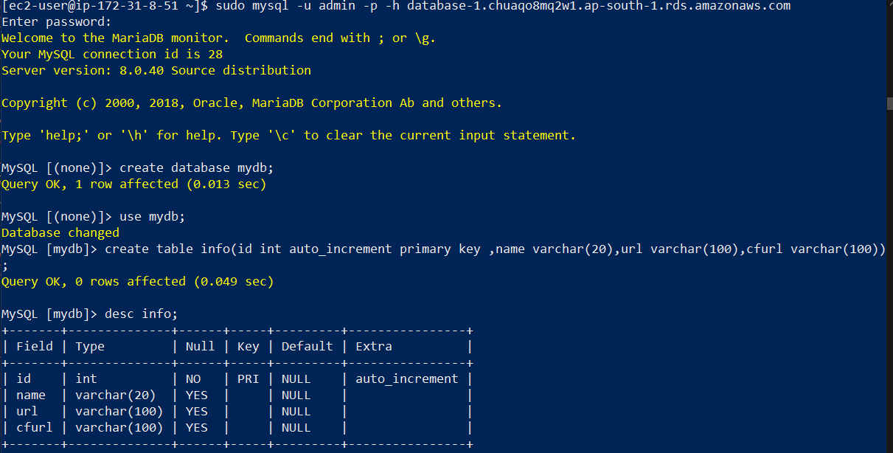
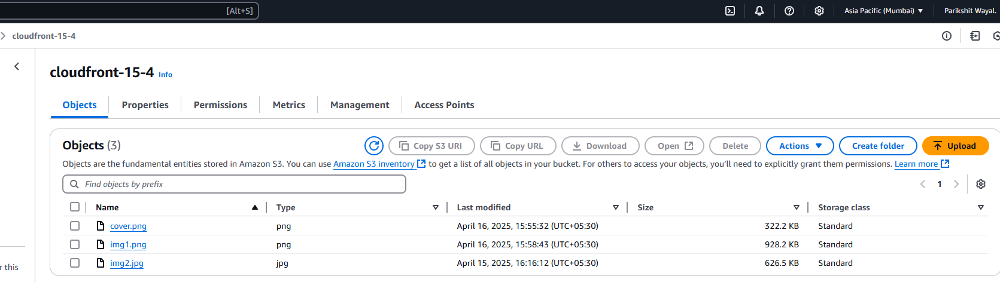
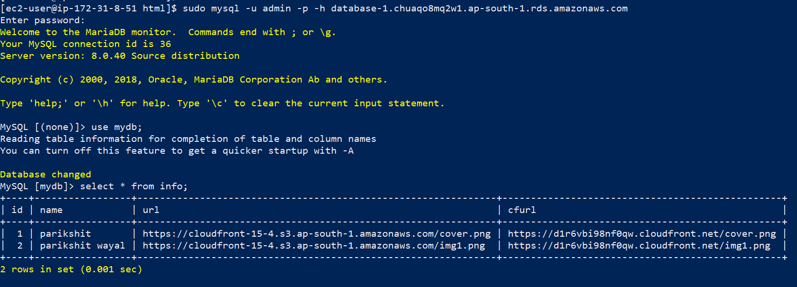
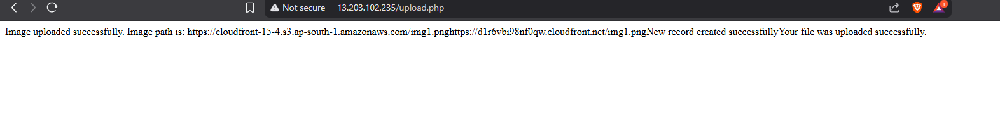

# 🚀 PHP Script to Upload to S3, Serve via CloudFront, and Save to RDS

In this project, I built an **image upload system** using a **LEMP stack** (Linux, Nginx, MySQL, PHP) hosted on an **EC2 instance**.  
The system integrates with:
- 🗃️ **AWS S3** for image storage  
- 🧾 **Amazon RDS** for metadata  
- 🚀 **CloudFront** for fast, low-latency content delivery  

> 💡 This hands-on practical helped me deeply understand AWS service integration and real-time file handling using PHP.
 

---

## 🧱 1. Installing LEMP Stack on EC2
- Installed **Nginx**, **MySQL**, and **PHP** on an EC2 Linux instance
 

---

## 🧾 2. Creating a Frontend Form
- Built a simple `form.html` using ChatGPT guidance with:
  - 👤 Input for Name
  - 🖼️ Image picker and Upload button
     


---

## 🔐 3. Setting Up IAM User for PHP Script
- Created a new **IAM user** from the AWS Console  
- (As posted earlier 📄) — used the **Access Key ID** and **Secret Access Key** with the PHP SDK

---

## 🪣 4. Creating an S3 Bucket for Image Storage
- Created an S3 bucket: `cloudfront-15-4`
   


---

## 🌐 5. Setting Up CloudFront for CDN
- Created a **CloudFront distribution** with the S3 bucket as the origin
 

---

## 🛢️ 6. Setting Up Amazon RDS
- Created a **MySQL RDS instance** using Free Tier with Easy Create
   

- Connected the RDS instance to the required EC2 instance
   

- Created a database `mydB` with a table named `info`
- Used the **RDS endpoint** to connect from the PHP script
   


---

## 🧑‍💻 7. Copying & Modifying PHP Backend
- Downloaded a PHP script for handling file uploads
- Modified the script to:
  - 🌍 Set AWS region to `ap-south-1`
  - 🔑 Authenticate using IAM credentials
  - 🔄 Replace the S3 URL with CloudFront URL using `str_replace()`
  - 🗃️ Insert **Name**, **S3 URL**, and **CloudFront URL** into **RDS MySQL**
  - 🛠️ Fill in DB connection values (RDS endpoint, DB name, password)
    ## 📄 PHP Script: Secure File Upload to S3 + Save Metadata to RDS

```php
<?php
require 'vendor/autoload.php';
use Aws\S3\S3Client;

// 🚀 Instantiate an Amazon S3 client
$s3Client = new S3Client([
    'version' => 'latest',
    'region'  => 'ap-southeast-2',
    // 'credentials' => [
    //     'key'    => ' AKIAR3KPMSXLXA5H ',
    //     'secret' => ' yH0f0bFXWZYubCWGnbqZuam1h2H2bXov'
    // ]
]);

// 📥 Check if form was submitted
if($_SERVER["REQUEST_METHOD"] == "POST"){
    if(isset($_FILES["anyfile"]) && $_FILES["anyfile"]["error"] == 0){
        $allowed = array("jpg" => "image/jpg", "jpeg" => "image/jpeg", "gif" => "image/gif", "png" => "image/png");
        $filename = $_FILES["anyfile"]["name"];
        $filetype = $_FILES["anyfile"]["type"];
        $filesize = $_FILES["anyfile"]["size"];

        // ✅ Validate extension
        $ext = pathinfo($filename, PATHINFO_EXTENSION);
        if(!array_key_exists($ext, $allowed)) die("Error: Please select a valid file format.");

        // ✅ Validate file size (Max 10MB)
        $maxsize = 10 * 1024 * 1024;
        if($filesize > $maxsize) die("Error: File size is larger than the allowed limit.");

        // ✅ Validate MIME type
        if(in_array($filetype, $allowed)){
            if(file_exists("uploads/" . $filename)){
                echo $filename . " already exists.";
            } else {
                if(move_uploaded_file($_FILES["anyfile"]["tmp_name"], "uploads/" . $filename)){
                    $bucket = 'eknaav'; // 🪣 Your bucket name
                    $file_Path = __DIR__ . '/uploads/' . $filename;
                    $key = basename($file_Path);

                    try {
                        $result = $s3Client->putObject([
                            'Bucket' => $bucket,
                            'Key'    => $key,
                            'Body'   => fopen($file_Path, 'r'),
                            'ACL'    => 'public-read',
                        ]);

                        echo "✅ Image uploaded successfully. Image path: ". $result->get('ObjectURL');
                        $urls3 = $result->get('ObjectURL');
                        $name = $_POST["name"];

                        // 🛢️ RDS Configuration
                        $servername = "database-1.cvdret5tnlxn.ap-southeast-2.rds.amazonaws.com";
                        $username = "root";
                        $password = "Vaishnavi123";
                        $dbname = "facebook";

                        $conn = mysqli_connect($servername, $username, $password, $dbname);

                        if (!$conn) {
                            die("Connection failed: " . mysqli_connect_error());
                        }

                        $sql = "INSERT INTO posts(name,url) VALUES('$name','$urls3')";

                        if (mysqli_query($conn, $sql)) {
                            echo "✅ New record created successfully";
                        } else {
                            echo "❌ Error: " . $sql . "<br>" . mysqli_error($conn);
                        }

                        mysqli_close($conn);

                    } catch (Aws\S3\Exception\S3Exception $e) {
                        echo "❌ Error uploading the file.\n";
                        echo $e->getMessage();
                    }

                    echo "✅ File uploaded successfully.";
                } else {
                    echo "❌ File is not uploaded";
                }
            }
        } else {
            echo "❌ Error: Invalid file type.";
        }
    } else {
        echo "❌ Error: " . $_FILES["anyfile"]["error"];
    }
}
?>
```
---
## Source Code for the PHP-Script and HTML : https://github.com/Parikshit-Wayal/AWS-Projects/blob/main/PHP-Code
---

## ✅ 8. Final Testing
- Accessed the form at: `http://<EC2_PUBLIC_IP>/form.html`
   

- Chose an image, entered a name, and submitted
   


### 🧪 Confirmed:
- ✅ Image uploaded to S3
   

- 🔄 URL replaced with CloudFront link

- 🧾 Metadata saved in RDS
   
- 🌐 Image accessible via CloudFront
- 🎉 Success message displayed by PHP
   


---

## 🎯 Final Result
An end-to-end functional system:
- 🔐 Secure IAM-based backend
- ⚡ High-speed delivery via CloudFront
- 🗃️ Clean data storage in Amazon RDS
- 🛠️ Real-world PHP integration with AWS services

---

⭐ *Cloud integrated web apps made easy with hands-on learning!*
