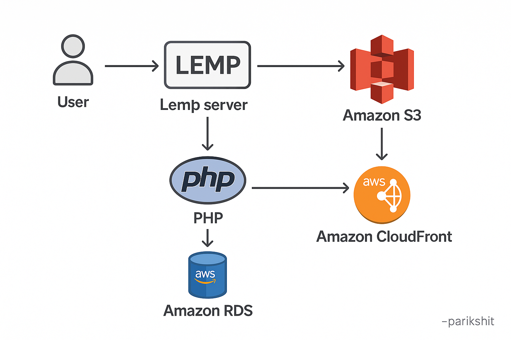
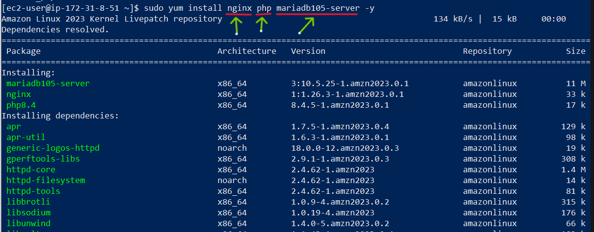

# 🚀 PHP Script to Upload to S3, Serve via CloudFront, and Save to RDS

In this project, I built an **image upload system** using a **LEMP stack** (Linux, Nginx, MySQL, PHP) hosted on an **EC2 instance**.  
The system integrates with:
- 🗃️ **AWS S3** for image storage  
- 🧾 **Amazon RDS** for metadata  
- 🚀 **CloudFront** for fast, low-latency content delivery  

> 💡 This hands-on practical helped me deeply understand AWS service integration and real-time file handling using PHP.
 

---

## 🧱 1. Installing LEMP Stack on EC2
- Installed **Nginx**, **MySQL**, and **PHP** on an EC2 Linux instance
 

---

## 🧾 2. Creating a Frontend Form
- Built a simple `form.html` using ChatGPT guidance with:
  - 👤 Input for Name
  - 🖼️ Image picker and Upload button

---

## 🔐 3. Setting Up IAM User for PHP Script
- Created a new **IAM user** from the AWS Console  
- (As posted earlier 📄) — used the **Access Key ID** and **Secret Access Key** with the PHP SDK

---

## 🪣 4. Creating an S3 Bucket for Image Storage
- Created an S3 bucket: `cloudfront-15-4`

---

## 🌐 5. Setting Up CloudFront for CDN
- Created a **CloudFront distribution** with the S3 bucket as the origin

---

## 🛢️ 6. Setting Up Amazon RDS
- Created a **MySQL RDS instance** using Free Tier with Easy Create
- Connected the RDS instance to the required EC2 instance
- Created a database `mydB` with a table named `info`
- Used the **RDS endpoint** to connect from the PHP script

---

## 🧑‍💻 7. Copying & Modifying PHP Backend
- Downloaded a PHP script for handling file uploads
- Modified the script to:
  - 🌍 Set AWS region to `ap-south-1`
  - 🔑 Authenticate using IAM credentials
  - 🔄 Replace the S3 URL with CloudFront URL using `str_replace()`
  - 🗃️ Insert **Name**, **S3 URL**, and **CloudFront URL** into **RDS MySQL**
  - 🛠️ Fill in DB connection values (RDS endpoint, DB name, password)

---

## ✅ 8. Final Testing
- Accessed the form at: `http://<EC2_PUBLIC_IP>/form.html`
- Chose an image, entered a name, and submitted

### 🧪 Confirmed:
- ✅ Image uploaded to S3
- 🔄 URL replaced with CloudFront link
- 🧾 Metadata saved in RDS
- 🌐 Image accessible via CloudFront
- 🎉 Success message displayed by PHP

---

## 🎯 Final Result
An end-to-end functional system:
- 🔐 Secure IAM-based backend
- ⚡ High-speed delivery via CloudFront
- 🗃️ Clean data storage in Amazon RDS
- 🛠️ Real-world PHP integration with AWS services

---

⭐ *Cloud integrated web apps made easy with hands-on learning!*
