<table>
  <tr>
    <td>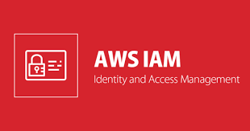</td>
    <td><h1 align="center">🔐 Exploring AWS IAM – Hands-On Experience! 💻☁️</h1></td>
  </tr>
</table>

<h3 align="center">
  🌐 <strong>AWS IAM (Identity and Access Management)</strong> is a service that helps you securely control access to AWS services and resources.  
  With IAM, you can manage users, groups, roles, and permissions within your AWS account.  
  It allows you to define who can access which AWS resources and what actions they can perform, ensuring security and compliance.
</h3>

---

## ⚙️ **Why This Practical?**
🎯 While learning IAM, I performed this hands-on activity to understand how **user, group, and permission management** works in AWS.

  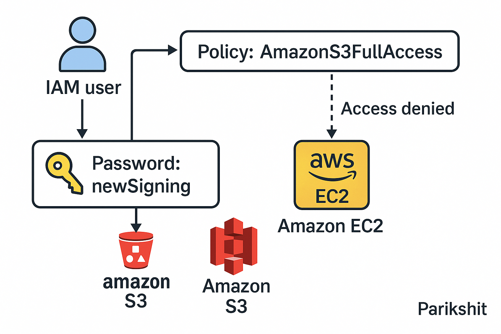

---

## 1️⃣ IAM USER CREATION WITH S3 FULL ACCESS
- 🧑‍💻 Created a new IAM user from the AWS console.
- 🔐 Assigned a custom password and enforced password reset on first sign-in.

  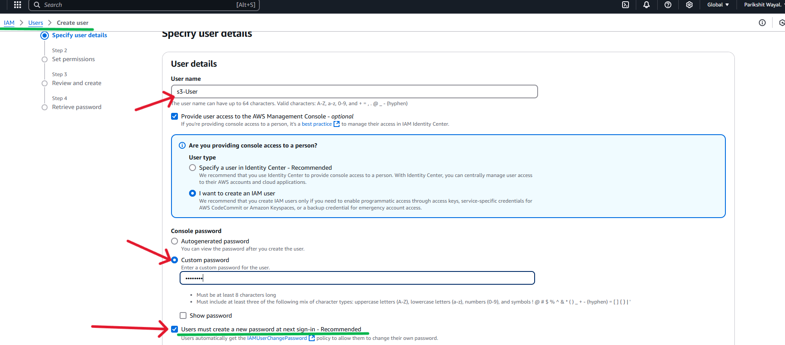

- ✅ Granted the user the **AmazonS3FullAccess** policy.

  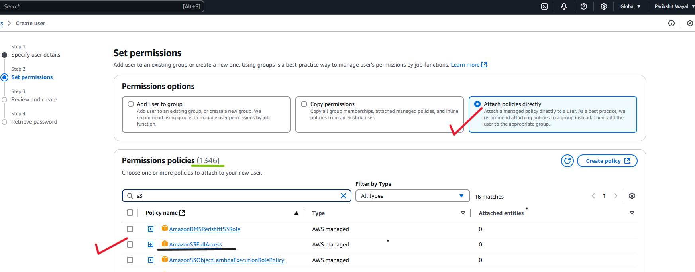

- 🔗 Received and saved the IAM user sign-in URL for login.

  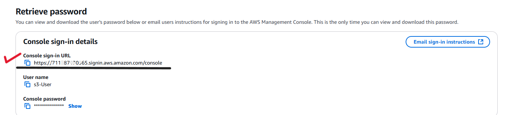

---

## 2️⃣ SIGNING IN AND ATTEMPTING EC2 ACCESS
- 🔑 Logged in using the IAM user via the sign-in URL.

  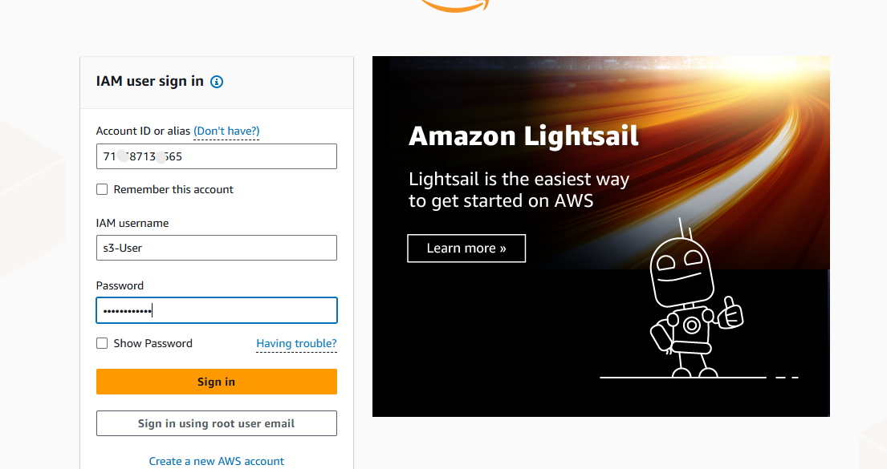

- 🚫 Tried launching an EC2 instance, but received an **unauthorized** or **not authenticated** error.

  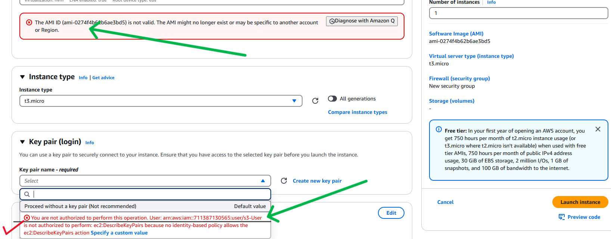

> ⚠️ This happened because the user only had S3 access and no permissions for EC2.

---

## 3️⃣ S3 BUCKET OPERATIONS USING IAM USER
- 🪣 Created a new S3 bucket named `s-3-bucket`.

  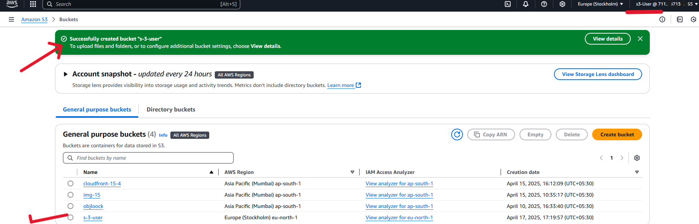

- 📁 Uploaded a file into the bucket.

  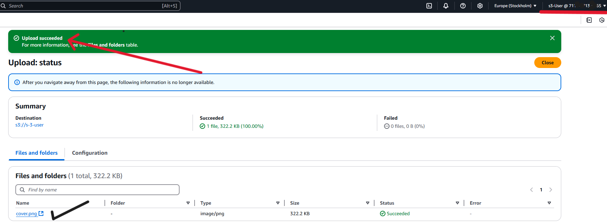

- 🗑️ Deleted an existing S3 bucket (ensured it was empty before deletion).

  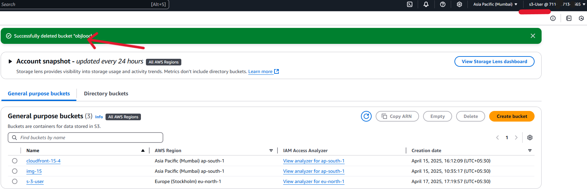

---

## 🔁 Simplifying Permission Management
- 👨‍👩‍👧 Now, I created a **user group** to streamline permission handling.
- ⏳ Assigning policies to each user individually is time-consuming and error-prone.
- ✅ Group-based access is more **efficient, manageable, and scalable**.

---

## 4️⃣ CREATING AN IAM GROUP FOR EC2 ACCESS
- 🔐 As the root user, created a group named **EC2FullAccessGroup**.
- 🧾 Attached the **AmazonEC2FullAccess** policy for EC2 operations.

  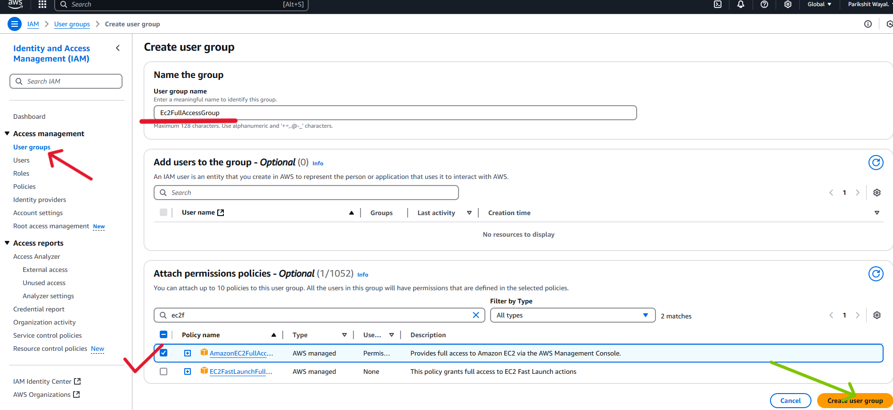

---

## 5️⃣ ADDING USERS TO EC2 ACCESS GROUP
- 👤 Created two IAM users: `Ec2-user1`, `Ec2-user2`.

  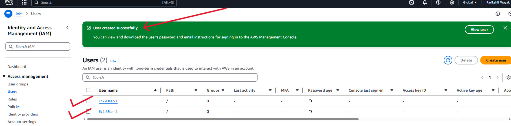

- ➕ Added both users to the **EC2FullAccessGroup**.  
  _(You can also add users while creating the group, like I did.)_

  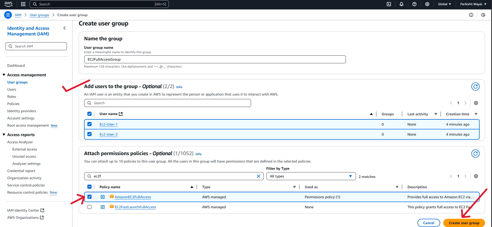

---

## 6️⃣ VERIFYING EC2 PERMISSIONS FOR GROUP USERS
- 🔓 Logged in as `Ec2-user1` using the IAM URL.
- 🚀 Successfully launched an EC2 instance.

  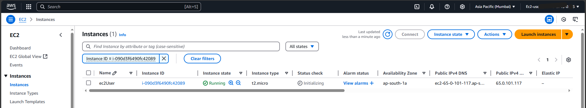

- 🚫 Tried accessing S3 but was denied.

  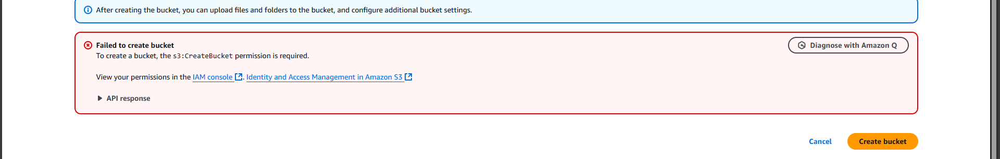

- ✔️ Verified that the users only had **EC2 permissions**, with no access to S3 or other services.

---

🎉 That’s how I explored AWS IAM practically – covering users, policies, groups, and access control across services like EC2 and S3!

